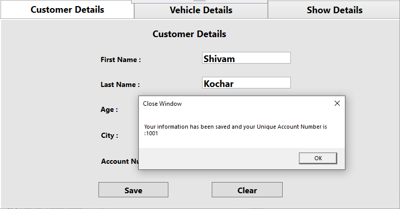
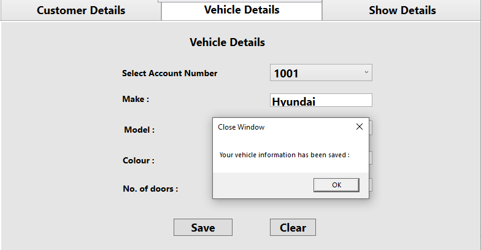
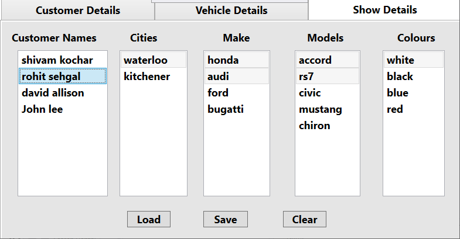

# CarRepairShop
An application to catalog and organize customers for a car repair shop.  
It's an WPF application build using c# in Visual Studio.  
It will allow the creation of a new customer, with the following attributes: Unique customer account number, first name, last name, age and city.  
When user clicks on a customer name in the list, the application highlights all the items in the other lists that are associated with that customer.  
<strong>Screenshots: </strong> 
<h3>1)</h3>
  
<h3>2)</h3>
  
<h3>3)</h3>

